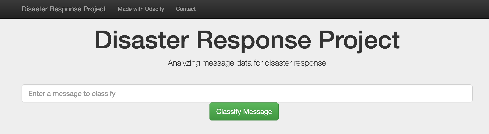
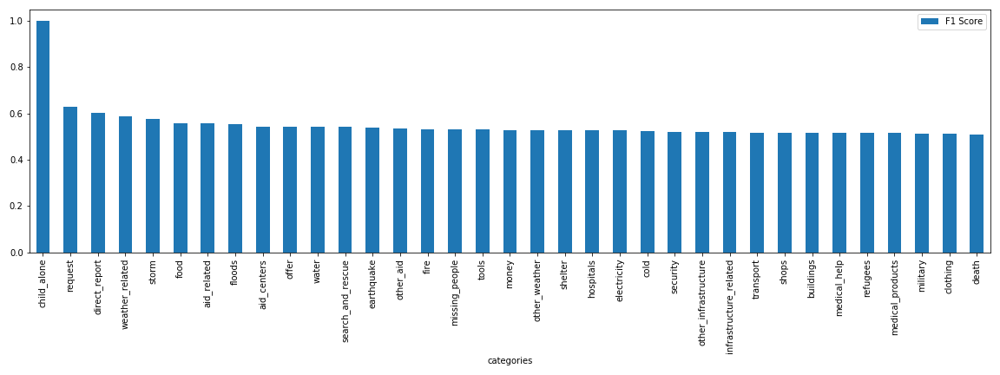
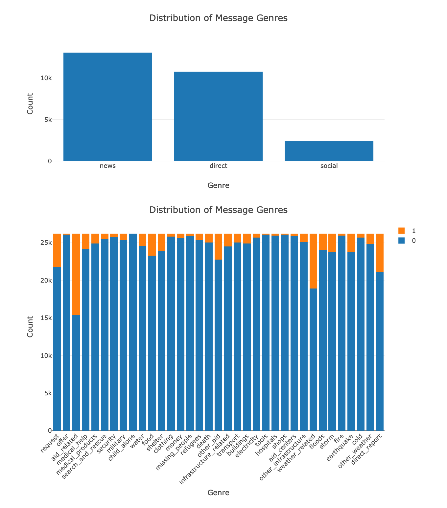
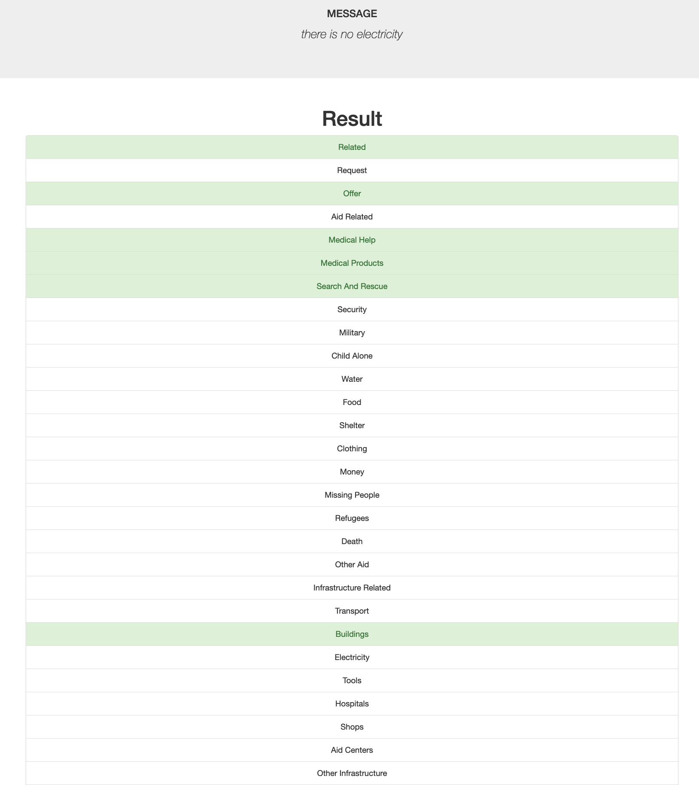

# Disaster Response Categorisation Project


## Table of Contents
1. [Description](#desc)
2. [Getting Started](#start)
	1. [Prerequisites](#prereq)
	2. [Data Preprocessing](#preprocess)
    3. [Model training](#training)
    4. [PEP8 style / Pylint](#pylint)
    5. [Model Evaluation](#model_evaluation)
    6. [App usage instructions](#instuctions)
    7. [Project folders structure](#structure)
3. [Author](#author)
4. [License](#license)

<a name="desc"></a>
# Description

The Project is part of Data Science Nanodegree Program by [Udacity](https://www.udacity.com/) in collaboration with [Figure Eight](https://www.figure-eight.com/). It aims to build a machine learning pipeline to categorize emergency messages based on the needs communicated by the sender.




### Messages potential Categories

    ```
    ['request', 'offer', 'aid_related', 'medical_help', 'medical_products',
        'search_and_rescue', 'security', 'military', 'child_alone', 'water',
        'food', 'shelter', 'clothing', 'money', 'missing_people', 'refugees',
        'death', 'other_aid', 'infrastructure_related', 'transport',
        'buildings', 'electricity', 'tools', 'hospitals', 'shops',
        'aid_centers', 'other_infrastructure', 'weather_related', 'floods',
        'storm', 'fire', 'earthquake', 'cold', 'other_weather',
        'direct_report']
    ```

<a name="structure"></a>
# Folders structure
	- app
	| - template
	| |- master.html  # main page of the web application
	| |- go.html  # classification result page of the web application
	|- run.py  # script for running the web application using Flask

	- data
	|- disaster_categories.csv  # messages categories dataset usesd for training the model
	|- disaster_messages.csv  # messages dataset used for training the model
	|- process_data.py # Script data processing
	|- DisasterResponse.db   # database to save clean data to

	- models
	|- train_classifier.py # Model training script
	|- classifier.pkl  # Model file

    - notebooks
    |- ETL Pipeline Preparation.ipynb
    |- ML Pipeline Preparation.ipynb

<a name="start"></a>
# Getting Started

<a name="prereq"></a>
## Prerequisites

- Create a `Python 3.6` conda virtual environment
    `conda create --name py36 python=3.6`
- Activate the new environment
    `conda activate py36`
- Install required packages by running the following command in the app's directory
    `pip install -r requirements.txt`

<a name="preprocess"></a>
## Data processing
Run the processing script in the data folder
e.g. `process_data.py disaster_messages.csv disaster_categories.csv DisasterResponse.db`

<a name="training"></a>
## Model training
Run the training script in the `models` folder
e.g. `train_classifier.py ../data/DisasterResponse.db classifier.pkl`

<a name="pylint"></a>
## PEP8 style / Pylint
You can check the scripts `PEP8 style` by running the following command in the project's top folder `pylint --rcfile .pylintrc file_path`.
e.g.
```
pylint --rcfile .pylintrc models/train_classifier.py
```

<a name="model_evaluation"></a>
## Model Evaluation
**F1 Score** of the disaster messages categories




<a name="instructions"></a>
## App usage instructions

1. Run the following commands in the project's root directory to set up your database and model.

    - To run ETL pipeline that cleans data and stores in database
        `python data/process_data.py data/disaster_messages.csv data/disaster_categories.csv data/DisasterResponse.db`
    - To run ML pipeline that trains classifier and saves
        `python models/train_classifier.py data/DisasterResponse.db models/classifier.pkl`

2. Run the following command in the app's directory to run your web app.
    `python run.py`

3. Go to http://0.0.0.0:3001/
You will get the home page with visualizations of the used training data set.

Sample Home Page



## Execution examples

- The message catgeories are highlighted in green

Sample Output



<a name="author"></a>
## Author

* [slitayem](https://github.com/slitayem)

<a name="license"></a>
## License
[](https://opensource.org/licenses/MIT)